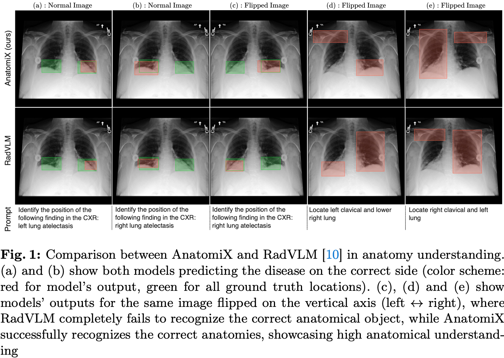

# AnatomiX: Anatomy-Aware Grounded Multimodal Large Language Model for Chest X-Ray Interpretation

**Anees Ur Rehman Hashmi, Numan Saeed, Christoph Lippert**  
*Hasso Plattner Institute · Mohamed bin Zayed University of AI*

[](https://arxiv.org/abs/2601.03191)
[]()

---

## Overview

Multimodal medical large language models have shown substantial progress in chest X-ray interpretation but continue to face challenges in spatial reasoning and anatomical understanding. Although existing grounding techniques improve overall performance, they often fail to establish a true anatomical correspondence, resulting in incorrect anatomical understanding in the medical domain. To address this gap, we introduce AnatomiX, a multitask multimodal large language model for anatomically grounded chest X-ray interpretation. Inspired by the radiological workflow, AnatomiX adopts a two-stage approach: first, it identifies anatomical structures and extracts their features, and then leverages a large language model to perform diverse downstream tasks such as phrase grounding, report generation, visual question answering, and image understanding. Extensive experiments across multiple benchmarks demonstrate that AnatomiX achieves superior anatomical reasoning and delivers over 25% improvement in performance on anatomy grounding, phrase grounding, grounded diagnosis, and grounded captioning tasks compared to existing approaches.



---

## Architecture

AnatomiX is a two-stage model:

**Stage 1 — Anatomy Perception Module (APM)**  
A DETR-style transformer detector with a ResNet-50 backbone and a PubMedBERT text encoder. It processes a chest X-ray and produces 36 anatomy-aware object queries, each representing a distinct anatomical region. Trained with a combination of detection losses and a contrastive loss that aligns visual region features with text descriptions.

**Stage 2 — Language Model (LM)**  
[MedGemma-4B-IT](https://huggingface.co/google/medgemma-4b-it) fine-tuned with SFT + LoRA using the TRL library. The LM receives the APM's object queries as additional visual context alongside a RAG-retrieved set of relevant findings, enabling grounded and anatomy-aware text generation across multiple tasks.

---

## Installation

**1. Create the conda environment**

```bash
conda env create -f environment.yaml
conda activate anatomix
```

**2. Install Python dependencies**

```bash
pip install -r _requirements.txt
```

**3. Configure environment variables**

Copy the template and fill in your paths:

```bash
cp .env.example .env
```

Edit `.env` to set cache directories and your HuggingFace token (required for gated models like MedGemma).

---

## Datasets

Download the following datasets and note their local paths — you will need them in the next step.

| Dataset | Source |
|---|---|
| MIMIC-CXR-JPG | [PhysioNet](https://physionet.org/content/mimic-cxr-jpg/2.1.0/) |
| Chest-ImaGenome | [PhysioNet](https://physionet.org/content/chest-imagenome/1.0.0/) |
| MS-CXR | [PhysioNet](https://physionet.org/content/ms-cxr/1.1.0/) |
| MIMIC-CXR-VQA | [PhysioNet](https://physionet.org/content/mimic-ext-mimic-cxr-vqa/1.0.0/) |
| RaDialog-Instruct | [PhysioNet](https://physionet.org/content/radialog-instruct-dataset/1.1.0/) |
| VinDr-CXR | [PhysioNet](https://physionet.org/content/vindr-cxr/1.0.0/) |
| SLAKE | [Website](https://www.med-vqa.com/slake/) |
| PadChest-GR | [Website](https://bimcv.cipf.es/bimcv-projects/padchest-gr/) |

---

## Data Processing

**1. Set dataset paths**

Create `configs/data_processing.json` with paths to your downloaded datasets:

```json
{
  "output_dir": "/path/to/output/datasets",
  "mimic_split_csv_path": "/path/to/data_split_with_labels.csv",
  "chest_imagenome_sg_dir": "/path/to/chest-imagenome",
  "mimic_images_dir": "/path/to/mimic-cxr-jpg/images",
  "mimic_orig_csvs_path": "/path/to/mimic-cxr-jpg/physionet.org",
  "mimic_reports_dir": "/path/to/mimic-cxr-jpg/reports",
  "mimic_instruciton_metadata_dir": "/path/to/output/mimic_report_gen",
  "mimiccxrvqa_dir": "/path/to/mimic-cxr-vqa/dataset",
  "vindrcxr_dir": "/path/to/vindr-cxr",
  "mscxr_dir": "/path/to/ms-cxr",
  "slake_dir": "/path/to/slake/Slake1.0",
  "radialog_instruct_path": "/path/to/radialog-instruct/mimic_cxr_instruct_llava_v2.json",
  "padchestgr_dir": "/path/to/padchest-gr"
}
```

**2. Process Chest-ImaGenome and MIMIC-CXR-JPG**

This extracts scene graphs and links them to MIMIC-CXR images:

```bash
cd src/data/preprocess/
python process_chest_imagenome.py \
    --cig_dir /path/to/chest-imagenome \
    --mimic_dir /path/to/mimic-cxr-jpg \
    --output_dir /path/to/output
```

**3. Create the data split CSV**

```bash
python data_split.py \
    --mimic_dir /path/to/mimic-cxr-jpg \
    --output_dir /path/to/output
```

This produces `data_split_with_labels.csv` used by all subsequent steps.

**4. Build the instruction-tuning dataset**

Processes all datasets into a unified instruction-tuning format:

```bash
python process_instruction_tuning.py
```

---

## Configuration

Training is controlled by `configs/anatomix_config.yaml`. Update the `data` sections with your local paths before training:

```yaml
apm:
  data:
    image_dir: /path/to/mimic-cxr/images
    sg_dir: /path/to/chest-imagenome/scene_graphs
    labels_csv_path: /path/to/data_split_with_labels.csv

lm:
  data:
    image_dir: /path/to/mimic-cxr/images
    data_dir: /path/to/instruction_tuning_data/

  sft_config:
    output_dir: /path/to/experiments/lm
```

---

## Training

### Stage 1: Train the APM

```bash
python train_apm.py \
    --config ./configs/anatomix_config.yaml \
    --mode train
```

To resume from a checkpoint:

```bash
python train_apm.py \
    --config ./configs/anatomix_config.yaml \
    --mode train \
    --training.resume last_checkpoint.pth
```

### Stage 2: Train the Language Model

The LM is trained in two steps. **Step 1** trains only the projection layers (alignment); **Step 2** fine-tunes the full model with LoRA.

```bash
# Step 1 — projector alignment
torchrun --nproc_per_node=4 train_lm.py \
    --config ./configs/anatomix_config.yaml \
    --lm.model_args.training_step 1 \
    --lm.sft_config.num_train_epochs 3 \
    --lm.sft_config.per_device_train_batch_size 2 \
    --lm.sft_config.gradient_accumulation_steps 4

# Step 2 — full fine-tuning
torchrun --nproc_per_node=4 train_lm.py \
    --config ./configs/anatomix_config.yaml \
    --lm.model_args.training_step 2 \
    --lm.sft_config.num_train_epochs 4 \
    --lm.sft_config.per_device_train_batch_size 1 \
    --lm.sft_config.gradient_accumulation_steps 8
```

---

## Inference

**1. Build the RAG database**

The RAG database is built once from the MIMIC-CXR training reports and used at inference time to retrieve relevant findings.

```bash
python ./src/rag/create_rag_db.py
```

**2. Run inference**

```bash
python train_apm.py \
    --config ./configs/anatomix_config.yaml \
    --mode inference
```

**Notebook demo**: See [`notebooks/inference.ipynb`](notebooks/inference.ipynb) for an end-to-end walkthrough on a single image.

---

## Checkpoints

Pre-trained model weights are available at [HuggingFace]() *(link coming soon)*.

Place downloaded checkpoints under `checkpoints/`:

```
checkpoints/
├── apm/          # APM weights
└── lm.pt         # LM weights (LoRA + projectors)
```

Update `configs/anatomix_config.yaml` to point to these paths if you change the default location.

---

## Citation

```bibtex
@article{hashmi2026anatomix,
  title={AnatomiX, an Anatomy-Aware Grounded Multimodal Large Language Model for Chest X-Ray Interpretation},
  author={Hashmi, Anees Ur Rehman and Saeed, Numan and Lippert, Christoph},
  journal={arXiv preprint arXiv:2601.03191},
  year={2026}
}
```
